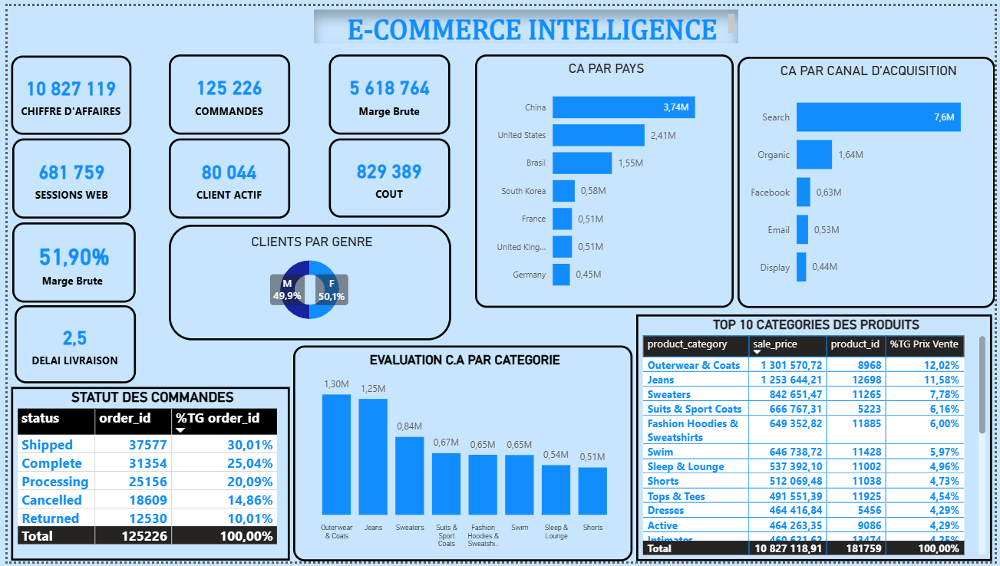

# 📊 E-Commerce Intelligence Dashboard — Power BI


> **Projet de Business Intelligence** visant à analyser les performances d'une activité e-commerce à travers des indicateurs clés de performance (KPI), des visualisations interactives et une segmentation multi-dimensionnelle.

---

## 🖼️ Aperçu du Dashboard



---

## 🎯 Objectif du Projet

Ce tableau de bord a été conçu pour répondre à une problématique métier concrète :

> **Comment piloter efficacement une activité e-commerce en identifiant les leviers de croissance, les canaux d'acquisition performants et les catégories de produits les plus rentables ?**

Il s'adresse à des profils décisionnels (Direction Commerciale, Marketing, Supply Chain) et permet une lecture rapide des performances globales ainsi qu'une analyse détaillée par dimension (pays, canal, catégorie, genre, statut de commande).

---

## 📁 Structure du Projet

```
📦 ecommerce-intelligence-powerbi
 ┣ 📊 e-commerce.pbix         # Fichier Power BI principal
 ┣ 🖼️ Capture.PNG             # Aperçu du dashboard
 ┗ 📄 README.md               # Documentation du projet
```

---
## 🧠 Modélisation des données

Le modèle de données suit une **modélisation en étoile (Star Schema)**, optimisée pour la performance et l’analyse.

.

### ⭐ Structure du modèle

**🔹 Table de faits**
- order_items : contient les transactions de vente
  Champs principaux :*id, order_id, user_id, product_id, inventory_item_id, status,created_at, shipped_at, delivered_at, returned_at, sale_price*
  
**🔹 Tables de dimensions**

-`inventory_items` : informations sur les stocks et les produits disponibles

 Champs principaux : *id, product_id, created_at, sold_at, cost, product_category,product_name, product_brand, product_retail_price,product_department, product_sku,roduct_distribution_center_id*
 
-`orders` : informations sur les commandes

 Champs principaux : *order_id, user_id, status, gender, created_at,returned_at, shipped_at, delivered_at, num_of_item*
 
-`products` : catalogue produits

 Champs principaux : *id, cost, category, name, brand, retail_price,department, sku, distribution_center_id*
 
-`users` : informations clients

 Champs principaux : *id, first_name, last_name, email, age, gender,state, address, postal_code, city, country,latitude, longitude, traffic_source, created_at*

### 🔗 Relations (Modélisation en étoile)
Le modèle de données suit une modélisation en étoile, où la table de faits **order_items** est au centre, reliée à plusieurs tables de dimensions via des clés étrangères.
Les relations sont définies comme suit :
- order_items est reliée à inventory_items via la colonne **inventory_item_id**
- order_items est reliée à orders via la colonne **order_id**
- order_items est reliée à products via la colonne **product_id**
- order_items est reliée à users via la colonne **user_id**

👉 Cette structure permet :
- une meilleure performance des requêtes
- une analyse multidimensionnelle efficace
- une simplification des mesures DAX

---

## 📌 KPIs Principaux

| Indicateur | Valeur | Description |
|---|---|---|
| 💰 **Chiffre d'Affaires** | 10 827 119 | Revenu total généré |
| 📦 **Commandes** | 125 226 | Nombre total de commandes |
| 💵 **Marge Brute (€)** | 5 618 764 | Bénéfice brut absolu |
| 📈 **Marge Brute (%)** | 51,90% | Ratio de rentabilité |
| 🛒 **Coût** | 829 389 | Coût opérationnel total |
| 👤 **Clients Actifs** | 80 044 | Clients ayant réalisé au moins un achat |
| 🌐 **Sessions Web** | 681 759 | Trafic total sur la plateforme |
| 🚚 **Délai de Livraison** | 2,5 jours | Délai moyen de livraison |

---

## 📊 Analyses Réalisées

### 1. 🌍 CA par Pays
Identification des marchés les plus porteurs à l'échelle mondiale.

- **Chine** : 3,74M (marché dominant)
- **États-Unis** : 2,41M
- **Brésil** : 1,55M
- **Corée du Sud, France, Royaume-Uni, Allemagne** : entre 0,45M et 0,58M

> 💡 **Insight** : La Chine représente à elle seule ~34% du CA total, ce qui soulève la question de la diversification géographique et des risques de dépendance.

---

### 2. 📣 CA par Canal d'Acquisition
Évaluation de l'efficacité des différents canaux marketing.

| Canal | CA |
|---|---|
| 🔍 Search (SEA) | 7,6M |
| 🌱 Organic (SEO) | 1,64M |
| 👍 Facebook Ads | 0,63M |
| 📧 Email Marketing | 0,53M |
| 🖥️ Display | 0,44M |

> 💡 **Insight** : Le Search génère à lui seul plus de 70% du CA, ce qui traduit une forte dépendance aux campagnes payantes. L'Organic représente un levier de croissance à fort potentiel et faible coût marginal.

---

### 3. 🛍️ Top 10 Catégories de Produits
Analyse des catégories par chiffre d'affaires et nombre de produits.

| Catégorie | CA | % du Total |
|---|---|---|
| Outerwear & Coats | 1 301 570 € | 12,02% |
| Jeans | 1 253 644 € | 11,58% |
| Sweaters | 842 651 € | 7,78% |
| Suits & Sport Coats | 666 767 € | 6,16% |
| Fashion Hoodies & Sweatshirts | 649 352 € | 6,00% |

> 💡 **Insight** : Les 2 premières catégories (Outerwear & Jeans) concentrent ~24% du CA, ce qui en fait des priorités stratégiques pour les stocks et les actions promotionnelles.

---

### 4. 📦 Statut des Commandes
Suivi du cycle de vie des commandes pour évaluer la performance opérationnelle.

| Statut | Nb Commandes | % |
|---|---|---|
| ✅ Shipped | 37 577 | 30,01% |
| ✔️ Complete | 31 354 | 25,04% |
| ⏳ Processing | 25 156 | 20,09% |
| ❌ Cancelled | 18 609 | 14,86% |
| 🔄 Returned | 12 530 | 10,01% |

> 💡 **Insight** : Un taux d'annulation de ~15% et un taux de retour de ~10% méritent une attention particulière — ils représentent un risque de perte de CA et de coûts logistiques significatifs.

---

### 5. 👥 Segmentation par Genre
Répartition quasi-équilibrée de la clientèle :
- **Femmes** : 50,1%
- **Hommes** : 49,9%

> 💡 **Insight** : La parité parfaite justifie une stratégie marketing mixte, sans sur-concentration sur un segment de genre.

---

### 6. 📉 Évaluation CA par Catégorie (Graphique en barres)
Visualisation comparative des 8 premières catégories, permettant d'identifier rapidement les catégories sous-performantes pour réallouer les budgets marketing.

---

## 🛠️ Compétences Techniques Mobilisées

### Power BI
- Création de **mesures DAX** (calcul de marges, pourcentages, agrégations conditionnelles)
- Modélisation de données (**relations entre tables**, schéma en étoile)
- Construction de **visuels personnalisés** (cartes KPI, graphiques en barres, tableaux dynamiques, donut chart)
- Mise en place d'un **thème cohérent** et d'une charte graphique professionnelle
- Optimisation des **interactions entre visuels** pour une navigation intuitive

### Analyse de Données
- Définition et calcul des **KPI métier** pertinents
- Analyse de **rentabilité** (marge brute, coût)
- Segmentation **multi-dimensionnelle** (géographique, canal, produit, démographique)
- Identification de **leviers de croissance** et de **points de vigilance**
- Storytelling data : traduction des données en **insights actionnables**

---

## 💡 Conclusions et Recommandations

| Axe | Observation | Recommandation |
|---|---|---|
| 🌍 Géographie | Forte concentration sur la Chine (34% CA) | Diversifier vers l'Europe et l'Amérique Latine |
| 📣 Acquisition | 70%+ du CA via Search payant | Investir dans le SEO pour réduire les coûts d'acquisition |
| 🛍️ Produits | Top 2 catégories = 24% du CA | Optimiser les stocks et promotions sur Outerwear & Jeans |
| 📦 Commandes | 25% d'annulations + retours | Analyser les causes et améliorer l'expérience post-achat |
| 💰 Rentabilité | Marge brute de 51,9% | Surveiller l'évolution des coûts pour protéger la marge |

---

## 🚀 Comment Ouvrir le Projet

1. Télécharger et installer **[Power BI Desktop](https://powerbi.microsoft.com/fr-fr/desktop/)** (gratuit)
2. Cloner ce repository :
   ```bash
   git clone https://github.com/votre-username/ecommerce-intelligence-powerbi.git
   ```
3. Ouvrir le fichier `e-commerce.pbix` avec Power BI Desktop
4. Explorer les visuels et les mesures DAX dans l'éditeur

---

## 👨‍💻 À Propos

Ce projet a été réalisé dans le cadre de la **constitution de mon portfolio Data Analyst**, avec pour objectif de démontrer mes compétences en :
- Business Intelligence & visualisation de données
- Analyse e-commerce & KPI marketing
- Modélisation de données et DAX
- Storytelling data orienté décision

---
## 📸 Aperçu du dashboard

[👉 Voir la Visualisation des données dans Power BI](https://drive.google.com/file/d/1MX1j0F1N3KRFiGhjGmEA4NJaPcnDdrN_/view?usp=drive_link).

[👉 Voir le fichier PDF inclus dans le repository](https://github.com/pigaloup/Projet-E-commerce-Analytics-Power-BI/blob/main/e-commerce.pdf).  

---

## 📬 Contact

Si vous souhaitez échanger sur ce projet ou discuter d'opportunités professionnelles :

[](https://www.linkedin.com/in/ablayegaloupdiop/)

[](mailto:elhadjiablayegaloupdiop@gmail.com)

---

> *"Without data, you're just another person with an opinion."* — W. Edwards Deming
